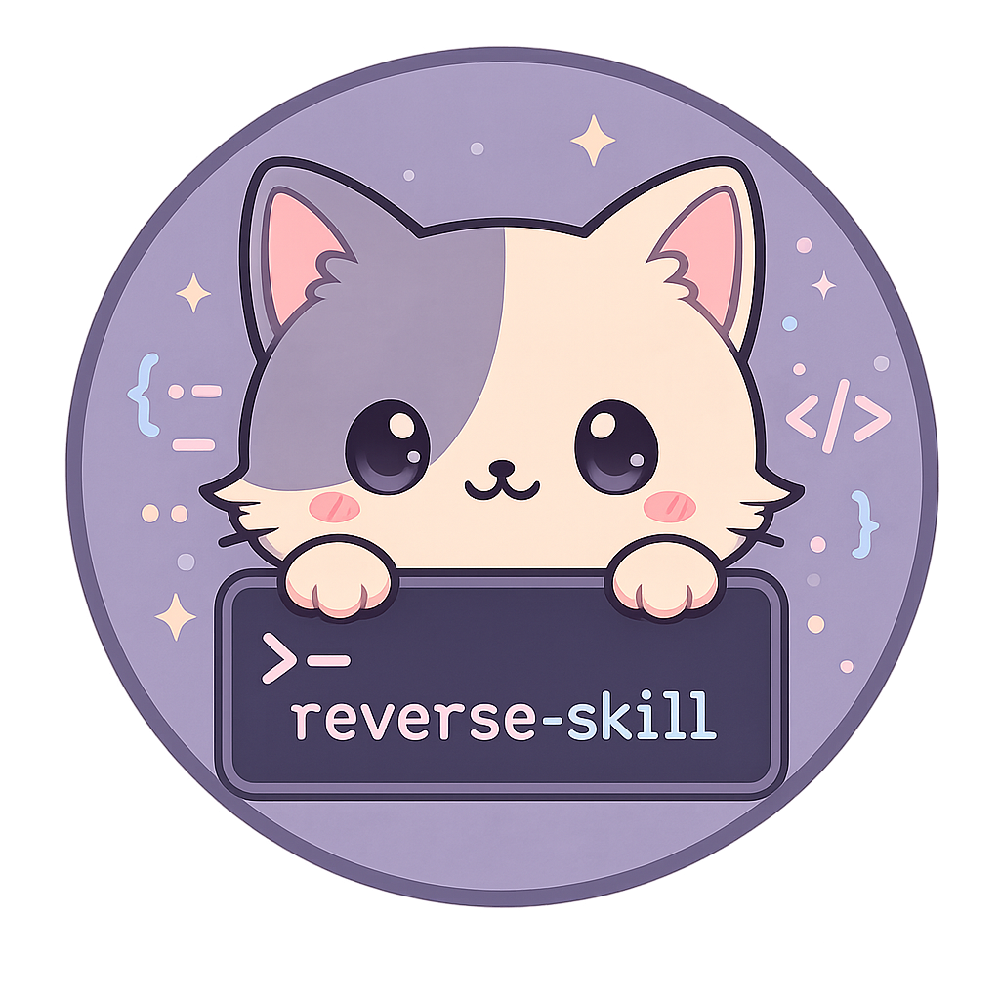

[English](README.en.md) | 中文版

<p align="center">
  
</p>

<h1 align="center">reverse-skill</h1>
<h3 align="center">資安與逆向工程技能路由包 · AI Coding Agent 的上線前安全閘門</h3>

<p align="center"><em style="font-family: 'KaiTi', 'STKaiti', 'SimSun', serif; font-size: 1.3em; color: #999;">破暗而行，逆水為舟</em></p>

<p align="center">
  <a href="https://github.com/SanHsien/reverse-skill/releases"></a>
  <a href="LICENSE"></a>
  <a href="CHANGELOG.md"></a>
  <a href="FORK.md"></a>
</p>

<p align="center">
  <a href="#專案定位">專案定位</a> ·
  <a href="#核心特色">核心特色</a> ·
  <a href="#支援領域">支援領域</a> ·
  <a href="#快速上手">快速上手</a> ·
  <a href="#windows-本機驗證">Windows 本機驗證</a> ·
  <a href="FORK.md">Fork 說明</a> ·
  <a href="NOTICE.md">授權聲明</a>
</p>

---

## 專案定位

現在許多開發者與非工程師能靠 Codex、Claude Code、Cursor 把網站、App、會員系統一路做出來。畫面正常、功能能跑，很容易讓人覺得可以直接部署上線。

**但「AI 幫你做得出來」跟「這套系統可以安全上線」完全是兩回事。**

API Key 是否外洩？會員 A 能不能看到會員 B 的資料？後端權限是否確實校驗？測試帳號、Debug 資訊、測試資料有沒有殘留在正式環境？有這些問題時，系統表面上一樣能正常運作。更麻煩的是，AI 修改完常常還會自信地回報：「已修正，可以部署。」

**`reverse-skill` 的定位就是放在「AI 做完」與「正式上線」中間：先檢查、修正、再驗證，最後才上線。**

它不是一般那種「按一下掃網站」的靜態工具，而是給 AI Coding Agent 用的**資安 Skill Router（技能路由器）**：
1. **精準分流**：先判斷任務類型，將問題分流到對應專屬 Skill，避免 AI 每次遇到安全問題都自己亂猜。
2. **工具自舉**：檢查環境可用的 CLI 工具、MCP 或內建腳本，按需提示或自舉工具鏈。
3. **固定驗證流程**：要求依照標準作業流程執行，留下完整的 Evidence（證據）、Finding（發現）、Path（路徑）與結構化報告。

---

## 核心特色

- **44 條路由規則 + 178 個回歸測試案例**：精確涵蓋常見資安、逆向與滲透分析場景。
- **45 個核心 Skill 模組**：橫跨二進位逆向、行動端、網頁前端、API、雲端與 LLM 安全。
- **嚴格授權門禁（Authorization Gate）**：所有主動測試動作前，必須具備明確授權與 Scope 契約（`scope.md`），不進行未經授權的掃描。
- **跨 AI 平台支援**：支援 Claude Code、Codex、Cursor、Kiro、Cline 等各大代碼 Agent 客戶端。
- **Windows-first 維護**：本 fork 補齊 Windows 11 + PowerShell 原生環境的執行與測試驗證鷹架。

---

## 支援領域

| 領域 | 涵蓋內容 |
|---|---|
| **行動端逆向** | APK / Android 逆向（JADX、Apktool、Frida）、iOS Runtime 分析 |
| **二進位與原生逆向** | IDA Pro / Ghidra / Binary Ninja / Radare2、Go & Rust 逆向、.NET 反編譯 |
| **網頁與前端安全** | 前端 JS 逆向與反混淆、瀏覽器擴充套件逆向、Headless 瀏覽器自動化 |
| **API 與服務安全** | REST / GraphQL RPC 分析、Burp Suite MCP 橋接、資料庫安全、身分聯邦（OAuth/OIDC） |
| **系統與雲端安全** | Windows AD 滲透、Cloud & K8s 控制面稽核、OT / ICS 工控安全 |
| **新興威脅防禦** | LLM 提示詞注入與安全性、供應鏈安全（SBOM、依賴鏈投毒檢查） |
| **報告與證據追蹤** | 標準化漏洞報告生成、證據鏈沉澱（`skills/ops/`） |

---

## 快速上手

### 1. 為 AI 終端載入 Skill 路由包

將本專案目錄置於或鏈結至 AI 工具的 Skill 目錄中：

#### Claude Code
```bash
# 於專案目錄中自動讀取 AGENTS.md 與 RULES.md
cd C:\GitHub\reverse-skill
```

#### Codex
```bash
# 將 skills 目錄拷貝或軟鏈結至 Codex skills 目錄
cp -r skills ~/.agents/skills/reverse-skill
```

#### Cursor
可在 Cursor 專案設定中加入 `.cursor/rules/` 規則，或直接在 Agent 對話中引用 `skills/MASTER-ROUTING.md`。

---

### 2. 路由測試與使用流程

當使用者提出資安分析需求時，可透過路由腳本分流：

```powershell
# Windows PowerShell
powershell -NoProfile -ExecutionPolicy Bypass -File skills/scripts/master-route.ps1 -Hint "分析 Android APK 的 API 請求簽名邏輯"
```

產出將指示 AI 前往對應的 `skills/apk-reverse/` 執行標準行動清單。

---

## Windows 本機驗證

本 fork 建立完整的 Windows 11 驗證閘門，在提交或同步上游前執行：

```powershell
# 初始化虛擬環境與開發依賴
python -m venv .venv
.venv\Scripts\python -m pip install --upgrade pip
.venv\Scripts\python -m pip install -r requirements-dev.txt

# 執行全套 Windows 開發檢驗
pwsh -NoProfile -File tools\dev_check.ps1
```

檢驗包含：
1. Maintainer Python 代碼語法編譯
2. Ruff 靜態檢查（`E9, F`）
3. Pytest 單元測試
4. 維護文件相對連結檢查（`tools/check_links.py`）
5. 倉庫安全邊界驗證（`verify-repository-security.py`）
6. 文件內部連結驗證（`verify-doc-links.py`）
7. 路由一致性與供應鏈釘選檢查（`verify-routing-coherence.ps1`）
8. 快速路由回歸測試（`test-routing.ps1 -Quick`）

---

## 授權與 Attribution

- 本專案 fork 自 [`zhaoxuya520/reverse-skill`](https://github.com/zhaoxuya520/reverse-skill)，採用 **[MIT License](LICENSE)** 授權。
- 原始專案作者為 zhaoxuya520 與社群貢獻者。
- 更多 fork 差異與維護背景請參閱 [`FORK.md`](FORK.md) 與 [`NOTICE.md`](NOTICE.md)。
